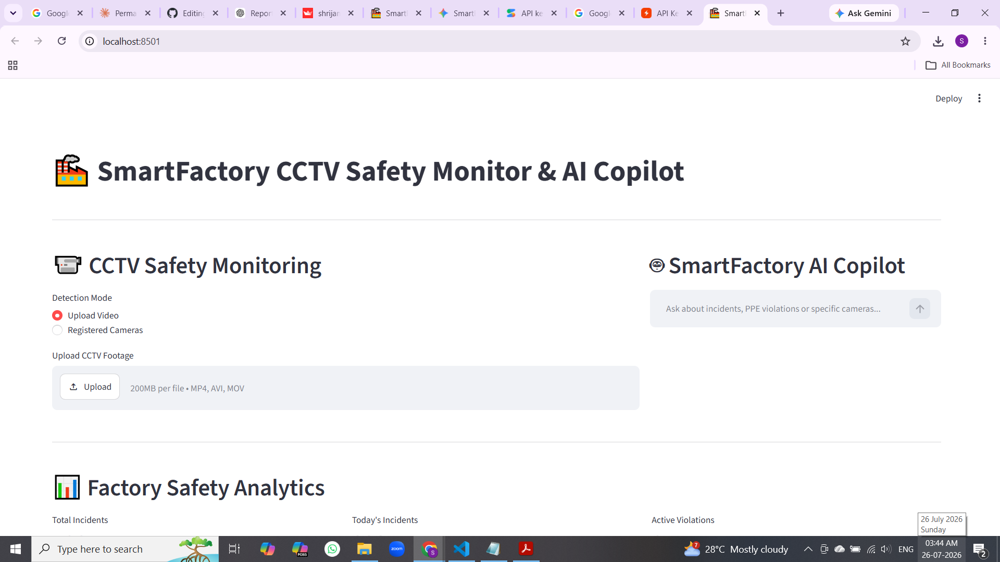
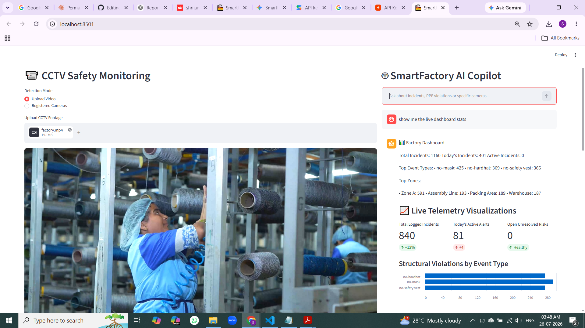
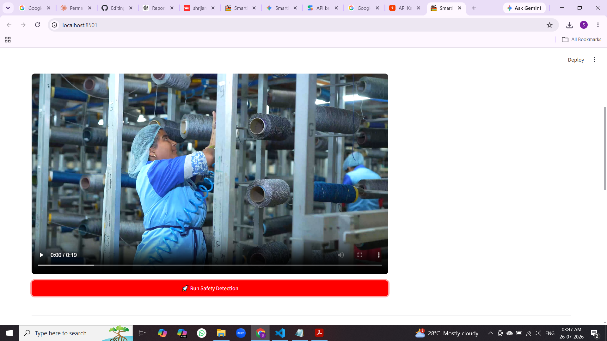
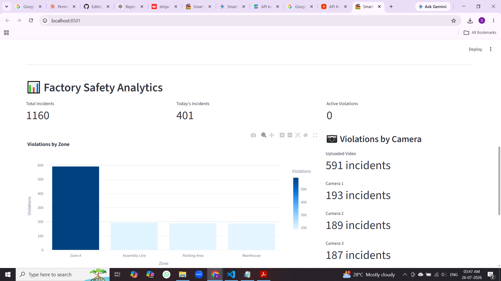

# 🏭 SmartFactory Copilot

**AI-powered Workplace Safety Monitoring Platform** — a computer-vision pipeline that detects PPE violations in real time, an agentic AI assistant that can answer questions about the data, and a Streamlit dashboard that ties it all together.


**🔗 Live App:** [smartfactory-cctv-ai-copilot.streamlit.app](https://smartfactory-cctv-ai-copilot-5xfsyojacxgcmzc4rerdqh.streamlit.app/)

**🎥 Demo Video:** https://www.loom.com/share/71b219c0ec814260aa5a6815f8fb2839

| Dashboard | AI Copilot |
|---|---|
|  |  |

| Live Detection | Factory Safety Analytics |
|---|---|
|  |  |

---

## Overview

SmartFactory Copilot watches CCTV footage the way a safety officer would — continuously, and without getting tired. It runs a fine-tuned YOLOv8 model over uploaded video, flags workers missing a hardhat or safety vest, and automatically logs every violation as a structured incident with a timestamped snapshot as proof.

On top of that detection layer sits an **agentic AI safety assistant**: instead of answering from one fixed prompt, it decides for itself whether a question needs an exact database lookup, a semantic search, or a stats summary — and can chain multiple lookups together to answer comparison questions like *"is this week better or worse than last week?"* Everything is surfaced through a single Streamlit dashboard: upload footage, watch live metrics update, chat with the assistant, and download a one-click PDF safety report.

The project started as a 4-day guided build, then went through a second pass to fix correctness bugs, fine-tune the detection model on real data, deepen the agent's reasoning, and harden the deployment pipeline for Streamlit Community Cloud. See [Known Limitations](#known-limitations) for an honest account of what's simplified and what isn't.

## Adding a Demo Video

Screenshots are already in place above. To add the demo video: sign up free at [loom.com](https://www.loom.com), install the Loom browser extension, open the live app, click the Loom icon → **Screen + Cam** (or Screen Only) → **Start Recording**, walk through uploading footage, live stats updating, a couple of AI Copilot questions, and generating a PDF report (2–3 minutes is plenty), stop the recording, and paste the auto-generated share link into the **🎥 Demo Video** line above.

## 🚀 Quick Start & Installation

```bash
# 1. Clone the repository
git clone https://github.com/<your-username>/smartfactory_copilot.git
cd smartfactory_copilot

# 2. Set up the Python virtual environment
python3 -m venv venv311
source venv311/bin/activate  # On Windows use: venv311\Scripts\activate

# 3. Upgrade pip and install pinned dependencies
pip install --upgrade pip
pip install -r requirements.txt

# 4. Configure local environment secrets
cat << 'EOF' > .env
GROQ_API_KEY="your_groq_api_key_here"
ENVIRONMENT="development"
EOF
# Get a free key at https://console.groq.com

# 5. Launch the Streamlit web dashboard
streamlit run app.py
```

The dashboard opens automatically at `http://localhost:8501`.

### Prerequisites

- Python 3.11+
- Git
- A free [Groq API key](https://console.groq.com)
- (Optional, for retraining) A free [Roboflow](https://roboflow.com) account and access to [Google Colab](https://colab.research.google.com)

### Adding the detection model weights

Model weights aren't committed to this repo (they're large binary files — GitHub blocks pushes over 100MB per file). Download `best.pt` from the [Construction Site Safety project on Roboflow](https://universe.roboflow.com/roboflow-universe-projects/construction-site-safety) (or use your own fine-tuned `best_finetuned.pt`) and place it inside `models/`.

### (Optional) Register cameras for multi-camera mode

```bash
python scripts/setup_cameras.py
```

## ⚙️ Recent Development Updates

During the production-readiness pass, the following improvements were made:

- **Persistent Vector Storage** — ChromaDB is used to maintain semantic embeddings of safety incidents, enabling natural-language retrieval and contextual reasoning by the AI assistant. As part of hardening this for cloud deployment, a stale `database/chroma/chroma.sqlite3` file that had been committed to the repo before `.gitignore` was updated was fully untracked from git history — since `.gitignore` only blocks new untracked files, the old vector index was otherwise still shipping with every "fresh" deploy.
- **Production Deployment Rigging** — Configured a `.gitignore` policy that excludes volatile runtime assets, heavy binaries (`.pt`, `.mp4`), and the vector index (`database/chroma/`), keeping cloud builds lightweight and free of local cache leaks.
- **Headless Cloud Computer Vision** — Swapped standard OpenCV for the pinned `opencv-python-headless` distribution so the CV pipeline runs inside headless cloud containers without triggering Qt/GUI runtime crashes.

## Key Features

- **🦺 PPE violation detection** — a fine-tuned YOLOv8 model flags missing hardhats, vests, and masks frame by frame, filtering out any detection the model is less than 50% confident about.
- **🔁 Persistent worker tracking** — ByteTrack (via `supervision`) assigns a consistent ID to each worker across frames instead of re-detecting them from scratch.
- **🧩 Incident deduplication** — a continuous violation (e.g., 10 seconds without a hardhat, ~300 frames) collapses into **one** incident with a start time, end time, and duration — not hundreds of duplicate rows.
- **📸 Automatic snapshot evidence** — every incident is saved with a timestamped image as visual proof under `assets/incidents/`.
- **🗃️ Dual-database storage** — SQLite for exact, structured queries (counts, filters by zone/date/type) and ChromaDB for semantic, natural-language search — both filled automatically by the same detection pipeline.
- **🤖 Agentic safety assistant** — a LangGraph tool-calling agent (`create_react_agent`, Groq-backed) that picks the right tool per question, chains multiple tool calls for multi-step questions, and remembers earlier turns in the same conversation via a memory checkpointer.
- **📝 AI-written incident reports** — a second, narrowly-scoped agent turns raw incident data into a plain-English prose summary, combined into a downloadable PDF alongside structured breakdowns by type and zone.
- **📈 Live dashboard** — upload footage, watch a progress bar, and see live totals, a violations-by-zone chart, and a per-camera breakdown.
- **🎥 Multi-camera support** — cameras are real rows in a database (name, zone, source), looped over dynamically, each with its own independent violation tracker.
- **⚡ Non-blocking processing** — detection runs in a background thread with an auto-refreshing status indicator, so the dashboard never freezes mid-run.

## 🧠 Dynamic Tool-Calling Architecture

Rather than a rigid, hardcoded classifier that pre-sorts questions into fixed categories, the assistant relies on **LLM-driven tool calling** via LangGraph's native `create_react_agent`:

- **Tool registration** — functions in `agents/tools.py` (e.g. `query_sql_db`, `semantic_vector_search`, `calculate_shift_stats`) are exposed to the LLM via LangChain's `@tool` decorator, along with their docstrings and argument schemas.
- **Dynamic selection at runtime** — on each question, the LLM reads the available tool descriptions and decides on the fly which tool (or sequence of tools) the question actually needs.
- **Multi-step chaining** — for a comparative question like *"is this week better or worse than last week?"*, there's no single hardcoded "comparison tool." The agent loops: it calls the SQL tool for this week's data, calls it again for last week's, then reasons over both results itself before responding.
- **Conversational memory** — a LangGraph `MemorySaver` checkpointer persists state across turns, so follow-up questions (*"what about Zone B?"*) work without repeating earlier context.

This design trades a simpler fixed-router architecture for real flexibility: the agent can fall back to a semantic search if a SQL query returns zero rows, chain tools for multi-step reasoning, and stay conversational — all without a separate classification layer to maintain.

## 📝 Executive Safety Report

One click generates an AI-written PDF report combining:

- Executive summary (plain-English prose, written by a narrowly-scoped report-writing agent)
- Incident statistics
- Violation-type and zone breakdowns
- Recommendations

## Architecture

```
Video
  │
YOLOv8 Detection
  │
ByteTrack (worker ID)
  │
Violation Engine (confidence filter + deduplication)
  │
SQLite  +  ChromaDB
  │
LangGraph Agent (dynamic tool calling + memory)
  │
Streamlit Dashboard
```

## How It Works

The system is built around five core components:

| Block | Role | Key files |
|---|---|---|
| 👁️ **The Eyes** | A YOLOv8 model — fine-tuned from a pretrained PPE checkpoint — scans each frame and draws boxes around people, hardhats, vests, masks, and more. | `models/detector.py` |
| 📖 **The Rulebook** | Confidence-filtered logic decides which boxes count as a real violation, and a per-worker tracker collapses a multi-frame violation into a single incident. | `cctv/safety_engine.py`, `cctv/violation_tracker.py` |
| 🗄️ **The Filing Cabinet** | SQLite for exact structured records; ChromaDB for meaning-based semantic search. Both populated automatically, in parallel, by the same pipeline. | `database/db.py`, `rag/ingest.py` |
| 🤖 **The Assistant** | A LangGraph agent that decides which tool to call — SQL lookup, semantic search, or stats — and can call more than one per question, with conversation memory. | `agents/copilot.py`, `agents/tools.py` |
| 📊 **The Dashboard** | A Streamlit page tying it all together — upload, live metrics, charts, chat, and PDF export. | `app.py` |

**Processing pipeline, end to end:**

```
Video frame → YOLOv8 detection → ByteTrack (worker ID) → confidence filter
    → violation rule-check → deduplication (ViolationTracker)
    → [snapshot saved] + [SQLite row] + [ChromaDB entry] → Dashboard / Agent
```

## Model Evaluation — Fine-Tuning Results

The PPE detection model was fine-tuned from the pretrained checkpoint using Ultralytics YOLOv8, then evaluated on a held-out test split. Final results:

| Metric | Value |
|---|---|
| Precision (Box(P)) | 0.589 |
| Recall (R) | 0.475 |
| mAP50 | 0.488 |

**Notes:**
- Highly accurate at detecting **Hardhats** (0.872 Precision)
- Excellent at catching **Masks** (0.81 Recall)

> Add a baseline (pre-fine-tuning) row here for a full before/after comparison — see the Day 6 fine-tuning notes for the exact `model.val()` steps used to produce these numbers.

## Tech Stack

| Layer | Technology |
|---|---|
| Language | Python 3.11 |
| Computer vision | YOLOv8 (Ultralytics), OpenCV (Headless), `supervision` (ByteTrack) |
| Structured storage | SQLite |
| Semantic storage | ChromaDB (`PersistentClient`) |
| Agentic AI | LangChain, LangGraph (`create_react_agent`, `MemorySaver`), Groq Llama 3.3 70B |
| Dashboard | Streamlit, Plotly, `streamlit-autorefresh`, `watchdog` |
| Reporting | fpdf2 |
| Training / dataset | Roboflow (Construction Site Safety dataset), Google Colab (T4 GPU) |

## Project Structure

```text
smartfactory_copilot/
├── app.py                      # Streamlit dashboard (entry point)
├── config.py                   # Loads GROQ_API_KEY from .env / st.secrets
├── requirements.txt             # Pinned cloud-production dependencies
├── .env                         # Local secrets — never committed
├── README.md
├── data/
│   ├── factory.mp4              # Camera 1 test footage
│   ├── factory2.mp4             # Camera 2 test footage (multi-camera)
│   └── sample.jpg
├── database/
│   ├── db.py                    # SQLite schema, connections, queries
│   ├── factory.db                # Generated at runtime
│   └── chroma/                   # ChromaDB persistent vector store (gitignored)
├── models/
│   ├── detector.py               # Cached YOLOv8 model loading + inference
│   ├── best.pt                   # Original pretrained PPE weights
│   └── best_finetuned.pt         # Fine-tuned weights
├── cctv/
│   ├── stream.py                  # Frame-by-frame video reader
│   ├── tracker.py                  # ByteTrack worker tracking
│   ├── safety_engine.py            # Violation rules + confidence filter
│   ├── violation_tracker.py        # Deduplicates violations into incidents
│   ├── snapshot.py                 # Saves proof images per incident
│   ├── incident_pipeline.py        # Wires detection → storage → RAG
│   └── multi_camera_runner.py      # Loops detection across active cameras
├── rag/
│   └── ingest.py                    # ChromaDB ingestion for semantic search
├── agents/
│   ├── tools.py                      # SQL lookup / semantic search / stats tools
│   ├── copilot.py                    # Main LangGraph agent (memory-enabled)
│   └── report_writer.py              # Secondary agent for prose report summaries
├── reports/
│   ├── generate_report.py             # PDF safety report builder
│   └── safety_report.pdf              # Generated on demand
├── scripts/
│   └── setup_cameras.py                # One-time camera registration
├── assets/
│   └── incidents/                      # Snapshot images (violation proof)
└── tests/
    ├── test_detection.py
    ├── test_rag.py
    └── test_agent.py
```

## `.gitignore`

```
# Environment variables
.env
!.env.example

# Python virtual environment
venv/
venv311/
.venv/

# Python cache
__pycache__/
*.py[cod]
*.pyo

# Database
*.db
factory.db
database/chroma/

# Streamlit
.streamlit/secrets.toml

# Editors
.vscode/
.idea/

# Generated reports
outputs/
reports/*.pdf

# Generated incident images
assets/incidents/

# Uploaded videos
*.mp4
*.avi
*.mov

# Model weights (download manually — see Getting Started)
models/*.pt
models/*.onnx

# Temp files
*.tmp
temp/

# OS
.DS_Store
Thumbs.db
```

> **Note:** if `database/chroma/` was ever committed before this rule was added, adding it to `.gitignore` alone won't remove it from the repo — git only ignores new, untracked files. Run `git rm -r --cached database/chroma` once to fully untrack it, then commit and push.

## 🔒 Deploying on Streamlit Community Cloud

1. Push this repo to GitHub.
2. Go to [share.streamlit.io](https://share.streamlit.io), sign in, and click **New app**.
3. Select your repo and branch, and set the main file path to `app.py`.
4. Before deploying, open **Advanced settings** and paste your key in TOML format:
   ```toml
   GROQ_API_KEY = "your_actual_key_here"
   ```
5. Click **Deploy**. Your app gets a live URL like `https://<your-app-name>.streamlit.app`.
6. Need to change a key later? Go to your app's settings from your [share.streamlit.io](https://share.streamlit.io) workspace → **Secrets** — it updates without a redeploy.

Since `config.py` currently reads only from `.env` via `python-dotenv`, add a small fallback so the same code works both locally and on Community Cloud:

```python
import os
import streamlit as st
from dotenv import load_dotenv

load_dotenv()
GROQ_KEY = os.getenv("GROQ_API_KEY") or st.secrets.get("GROQ_API_KEY")
```

**A note on file size:** GitHub blocks pushes over 100MB per file. If `best.pt` / `best_finetuned.pt` or your sample videos are large, use [Git LFS](https://git-lfs.com/) or host them elsewhere (a GitHub Release asset, cloud storage bucket) and download them at startup instead of committing them directly.

## Usage

1. **Upload footage** — drop an `.mp4` file into the uploader and click **Run Detection**.
2. **Watch live stats** — total violations, violation types, and zones affected update as soon as processing finishes.
3. **Check the zone / camera breakdown** — a Plotly bar chart and a per-camera list show where violations are concentrated.
4. **Ask the assistant** anything about the data, for example:
   - *"How many total violations were detected?"*
   - *"Which zone has the most violations?"*
   - *"Compare the number of violations in the last 7 days versus the 7 days before that — is it getting better or worse?"*
   - *"How many violations happened in Zone A?"* → *"What about Zone B?"* (follow-up questions work — the agent remembers context)
5. **Generate a report** — click **Generate PDF Safety Report** for an AI-written summary plus a structured breakdown, ready to download.

## Known Limitations

Being upfront about what's simplified is part of what makes the rest of the project credible:

- **Threading ≠ true parallelism.** Background processing keeps the dashboard responsive, but Python's Global Interpreter Lock means it doesn't give CPU-heavy YOLO inference a real parallel speed boost. A production system would use multiprocessing or separate worker machines for that.
- **Cameras are local video files, not live feeds.** The `cameras` table is designed to scale to many sources, but currently points at local `.mp4` files rather than real RTSP network streams.
- **SQLite, not Postgres.** Fine for a single-user demo; a real multi-camera, multi-user deployment would want a database built for concurrent writes.
- **The detection model is fine-tuned, not trained from scratch.** It started from a pretrained checkpoint on the Roboflow Construction Site Safety dataset.
- **The "heatmap" is zone-level, not pixel-level.** It's a color-scaled bar chart by zone, not a true spatial heatmap overlaid on camera footage.
- **Role-based login and predictive maintenance are not implemented**, despite appearing in early project notes.

## Future Improvements

- [ ] Multi-camera RTSP streaming instead of local video files
- [ ] Migrate from SQLite to a PostgreSQL backend for concurrent multi-user writes
- [ ] Redis caching for faster repeated queries
- [ ] User authentication / role-based login (Manager / Admin / Safety Officer)
- [ ] Real-time alert notifications
- [ ] Cloud object storage for snapshots and reports
- [ ] Mobile-friendly dashboard
- [ ] Baseline (pre-fine-tuning) metrics alongside current results for a full before/after comparison
- [ ] True parallel processing across cameras via multiprocessing / separate workers
- [ ] Pixel-coordinate heatmap overlay on camera footage
- [ ] Date-range picker in the dashboard for custom PDF report windows

## Acknowledgments

- [Roboflow](https://roboflow.com) and the [Construction Site Safety](https://universe.roboflow.com/roboflow-universe-projects/construction-site-safety) dataset/project for the base PPE detection dataset and pretrained weights
- [Ultralytics YOLOv8](https://github.com/ultralytics/ultralytics)
- [LangChain / LangGraph](https://www.langchain.com/langgraph) and [Groq](https://groq.com/) for the agentic assistant
- [Pexels](https://www.pexels.com/) and [Pixabay](https://pixabay.com/) for free, license-friendly test footage

## Contributing

This started as a personal learning project, but issues and pull requests are welcome if you spot a bug or have an idea worth adding.
